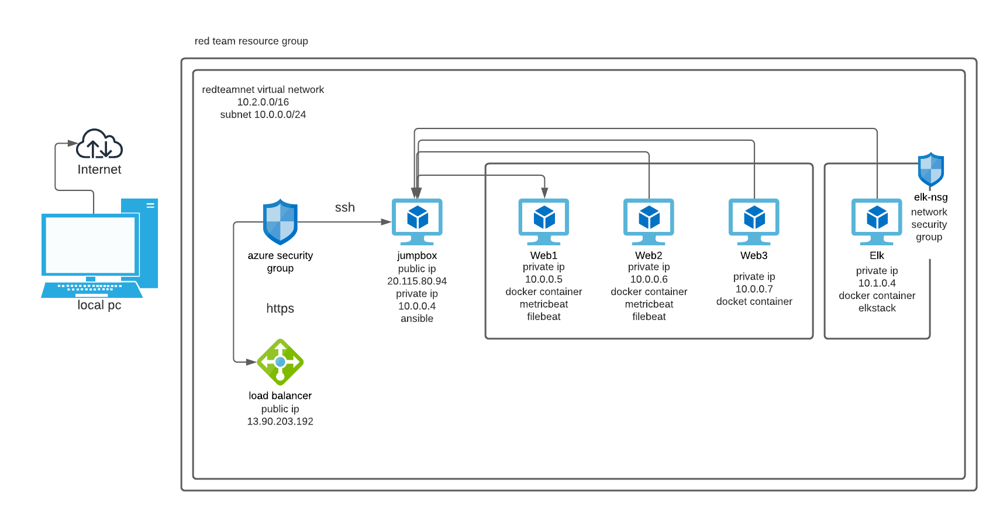
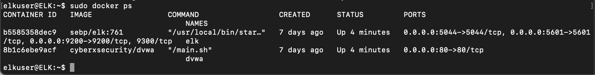

# project1

## Automated ELK Stack Deployment

The files in this repository were used to configure the network depicted below.

These files have been tested and used to generate a live ELK deployment on Azure. They can be used to either recreate the entire deployment pictured above. Alternatively, select portions of the _____ file may be used to install only certain pieces of it, such as Filebeat.

  - filebeat-playbook.yml

This document contains the following details:
- Description of the Topologu
- Access Policies
- ELK Configuration
  - Beats in Use
  - Machines Being Monitored
- How to Use the Ansible Build

### Description of the Topology

The main purpose of this network is to expose a load-balanced and monitored instance of DVWA, the D*mn Vulnerable Web Application.

Load balancing ensures that the application will be highly _____, in addition to restricting _____ to the network.
- _TODO: What aspect of security do load balancers protect? What is the advantage of a jump box?_
- load balancers distribute traffic among servers, lightening the load & managing traffic. the avantage of of a jumpbox is everything is managed on a secure system, & allows admins to access the environment remotely in a secure zone.

Integrating an ELK server allows users to easily monitor the vulnerable VMs for changes to the _____ and system _____.
- _TODO: What does Filebeat watch for?_ Filbeat is used to forward, monitor, & log data
- _TODO: What does Metricbeat record?_ Metricbeat collects statistics from the target servers & the seervices running on them & sends them to elasticsearch (in the instance). can also monitor filebeat & elk stack

The configuration details of each machine may be found below.
_Note: Use the [Markdown Table Generator](http://www.tablesgenerator.com/markdown_tables) to add/remove values from the table_.

| name    	| function 	| ip address   	| operating system 	|
|---------	|----------	|--------------	|------------------	|
| jumpbox 	| gateway  	| 20.115.80.94 	| linux            	|
| web1    	| ansible  	| 10.0.0.5     	| linux            	|
| web2    	| ansible  	| 10.0.0.6     	| linux            	|
| elk     	| elkstack 	| 10.1.0.4     	| linux            	|

### Access Policies

The machines on the internal network are not exposed to the public Internet. 

Only the _____ machine can accept connections from the Internet. Access to this machine is only allowed from the following IP addresses:
- _TODO: Add whitelisted IP addresses_
- my ip 69.117.190.27
- jumpbox ip 10.0.0.4

Machines within the network can only be accessed by _____.
- _TODO: Which machine did you allow to access your ELK VM? What was its IP address?_
- jumpbox 10.0.0.4

A summary of the access policies in place can be found in the table below.

| name    	| publically accessible 	| allowed ip addresses 	|
|---------	|-----------------------	|----------------------	|
| jumpbox 	| no                    	| 69.117.190.27        	|
| web1    	| no                    	| 10.0.0.4             	|
| web2    	| no                    	| 10.0.0.4             	|
| elk     	| no                    	| 10.0.0.4             	|

### Elk Configuration

Ansible was used to automate configuration of the ELK machine. No configuration was performed manually, which is advantageous because...
- _TODO: What is the main advantage of automating configuration with Ansible?_
- you can reuse your playbooks & modify to use on any number of machines multiple times. saves time from using single commands & helps you to be able to check your work & troubleshoot in one place. you can also keep track of what each command is, helping other users who may need to run these commands

The playbook implements the following tasks:
- _TODO: In 3-5 bullets, explain the steps of the ELK installation play. E.g., install Docker; download image; etc._
- install docker, install python3, install docker module, increase virtual memory, use more memory, download & launch a docker elk container, enable docker on boot

The following screenshot displays the result of running `docker ps` after successfully configuring the ELK instance.

### Target Machines & Beats
This ELK server is configured to monitor the following machines:
- _TODO: List the IP addresses of the machines you are monitoring_
- 10.0.0.5
- 10.0.0.6

We have installed the following Beats on these machines:
- _TODO: Specify which Beats you successfully installed_
- filebeat
- metricbeat

These Beats allow us to collect the following information from each machine:
- _TODO: In 1-2 sentences, explain what kind of data each beat collects, and provide 1 example of what you expect to see. E.g., `Winlogbeat` collects Windows logs, which we use to track user logon events, etc._

### Using the Playbook
In order to use the playbook, you will need to have an Ansible control node already configured. Assuming you have such a control node provisioned: 

SSH into the control node and follow the steps below:
- Copy the _____ file to _____.
- Update the _____ file to include...
- Run the playbook, and navigate to ____ to check that the installation worked as expected.

_TODO: Answer the following questions to fill in the blanks:_
- _Which file is the playbook? Where do you copy it?_
- elk.yml
- _Which file do you update to make Ansible run the playbook on a specific machine?
- config file
-   How do I specify which machine to install the ELK server on versus which to install Filebeat on?_
-   specify which hosts you would like to use, in this instance we created a group webservers to install on both web1 & web2 vms
- _Which URL do you navigate to in order to check that the ELK server is running?
- http://20.109.1.194:5601/app/kibana
- 

_As a **Bonus**, provide the specific commands the user will need to run to download the playbook, update the files, etc._

curl https://github.com/brittanydodd/project1/blob/main/ansible/elk.yml
